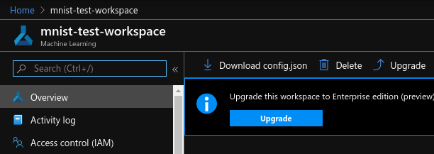

# Instructions

#### Clone this repo

```
git clone https://github.com/nateraw/pytorch-lightning-azureml
cd pytorch-lightning-azureml/
```
#### Make a clean conda environment locally for development

```
conda create -n pl_azureml_env -y python=3.6 --no-default-packages
conda activate pl_azureml_env
pip install -r dev_requirements.txt
```

#### Create a new AzureML Workspace resource in Azure Portal

You'll be prompted to name your workspace, link it to subscription, resource group, etc. I named mine `mnist-test-workspace`.


#### From that resource, download the associated `config.json` file

Click the button that says "Download config.json". Once downloaded, place it inside of this repo (`<some_path>/pytorch-lightning-azureml/config.json`)




# References
  - [This great blogpost](https://www.blue-granite.com/blog/train-and-deploy-machine-learning-models-using-the-azureml-service)
  - [Azure's Notebook Walkthrough](https://github.com/Azure/MachineLearningNotebooks/blob/master/how-to-use-azureml/ml-frameworks/pytorch/deployment/train-hyperparameter-tune-deploy-with-pytorch/train-hyperparameter-tune-deploy-with-pytorch.ipynb)